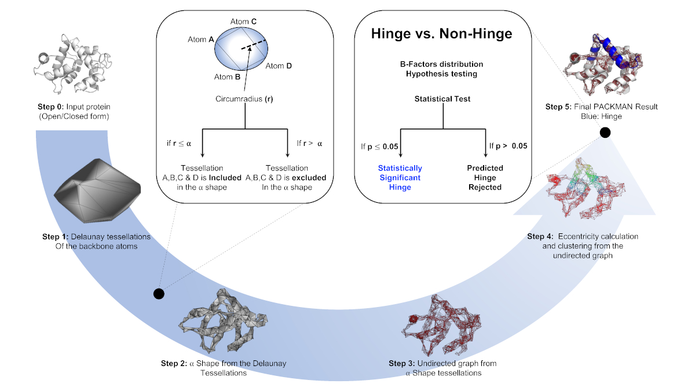

.. _tutorials_hinge_prediction:

Hinge Prediction using Alpha Shape (Commandline)
================================================

This tutorial familiarises users with the command line interface of the Hinge Prediction algorithm using Alpha Shapes. The same functionality is also available in the PACKMAN API ( :ref:`tutorials_predict_hinge` ).

Web Server: https://packman.bb.iastate.edu/

How to cite::

    Pranav M. Khade, Ambuj Kumar, Robert L. Jernigan, Characterizing and Predicting Protein Hinges for 
    Mechanistic Insight, Journal of Molecular Biology, Volume 432, Issue 2, 2020, Pages 508-522,
    ISSN 0022-2836, https://doi.org/10.1016/j.jmb.2019.11.018.

QUICK ALGORITHM OVERVIEW
------------------------

Please visit the following for the 15 minute video about the algorithm: https://youtu.be/3ALOxMqR1EA

INSTRUCTIONS
------------

Following is the PACKMAN interface description::

    usage: packman [-h] [-pdbid PDB_ID]
                    [--e_clusters NumberOfEccentricityClusters]
                    [--minhnglen MinimumHingeLength] [--chain CHAIN]
                    [--generateobj GENERATEOBJ] [--outputfile OUTPUTFILE]
                    [--logfile LOGFILE] [--callbackurl CALLBACKURL]
                    [--nodeid NODEID]
                    AlphaValue FILENAME

    PACKMAN: PACKing and Motion ANalysis. (https://github.com/Pranavkhade/PACKMAN)

    positional arguments:
    AlphaValue            Recommended: 2.8 for closed; 4.5 for open form, Please
                            refer to the paper for more details
    FILENAME              Path and filename of the PDB file.

    optional arguments:
    -h, --help            show this help message and exit
    -pdbid PDB_ID, --pdbid PDB_ID
                            If provided, the PBD with this ID will be downloaded
                            and saved to FILENAME.
    --e_clusters NumberOfEccentricityClusters
                            Recommended: 4, Please refer to the paper for more
                            details
    --minhnglen MinimumHingeLength
                            Recommended: 5, Please refer to the paper for more
                            details
    --chain CHAIN         Enter The Chain ID
    --generateobj GENERATEOBJ
                            Path and filename to save the .obj file at. Ignored
                            unless --chain is provided.

    Web server parameters:
    Used by the web form

    --outputfile OUTPUTFILE
                            Path and filename write output to
    --logfile LOGFILE     Path and filename write log messages to
    --callbackurl CALLBACKURL
                            Optional callback url if this script was called from
                            Drupal.
    --nodeid NODEID       Optional node id if this script was called from
                            Drupal.

EXAMPLES
--------

1. `python -m packman --pdbid 1prw 2.8 1prw.pdb` OR `packman --pdbid 1prw 2.8 1prw.pdb` for --pdbid, the parameter is the PDB ID the user submits to download a corresponding PDB file. First positional parameter 2.8 is the alpha value parameter which can be changed. and second is the name of the file you wish to save the downloaded PDB file.

2. `python -m packman 2.8 1prw.pdb` OR `python packman 2.8 1prw.pdb` First parameter 2.8 is the alpha value parameter which can be changed. second parameter is the parameter is location and name of the PDB file.

OPTIONAL
---------
If you wish to visualize the plane of the hinge, please refer to the following article: 

* Plane Wizard (PyMOL wiki) : https://pymolwiki.org/index.php/Plane_Wizard