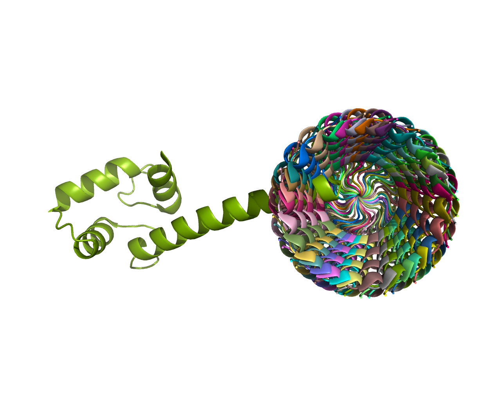

.. _tutorials_bond_rotate:

Rotate specific bonds
=====================

This tutorial helps users how to rotate specific bonds using Molecule submodule

Citation::
    
    Pranav M Khade, Robert L Jernigan, PACKMAN-Molecule: Python toolbox for structural bioinformatics,
    Bioinformatics Advances, Volume 2, Issue 1, 2022, vbac007, https://doi.org/10.1093/bioadv/vbac007

Step 1
------
1. Import the submodule::
   
    from packman import molecule

Step 2
------
1. Download the PDB file
2. Load the PDB file into the 'mol' object::
   
   pdbid = '1exr'
   molecule.download_structure(pdbid,save_name=pdbid)
   mol = molecule.load_structure(pdbid+'.cif')

Step 3
------
Get the atoms that define the bond between the atoms. You can also select other atoms in various ways. Please check the molecule object tutorial for more details.

Here, we are selecting atoms with ID 228 and 230. They form a peptide bond between 25th and 26th Amino acid for the given example::

   atom1 = mol[0].get_atom(228)
   atom2 = mol[0].get_atom(230)

Step 4
------
Find the common bond between these atoms using Atom.get_bond() function. Please note that you can also iterate over other bonds by using Atom.get_bonds() and also use Atom.get_bond() with atom id.::

    common_bond = atom1.get_bond(atom2)
    #Another way:
    #common_bond = atom1.get_bond(230)

Step 5
------
We can rotate the bonds by using bond.set_torsion() function. (Use bond.get_torsion() to measure the torsion angle). By default, the function uses radians as units. Define radians=False if you want to specify the angle in degrees.

Start with the following function, and one by one, the program will guide you through the parameter selection (selecting neighbor1 and neighbor2); here, we select 10-degree rotation to select the neighbors.::

    common_bond.set_torsion(10,radians=False)
    #The following commented code would be suggested by the program in the scenario after selecting parameters one by one.
    #common_bond.set_torsion(10,neighbor1=227,radians=False)
    #common_bond.set_torsion(10,neighbor1=227,neighbor2 = 231,radians=False)

Here, we rotate the bond selected above 0 to 350 by 10 degrees and save the conformation in a new file.::

   for i in range(0,360,10):
       common_bond.set_torsion(i, neighbor1=227, neighbor2 = 231,radians=False)
       mol.write_structure('X'+str(i)+'.cif',ftype='cif')

Check the conformations saved in the present working directory.

