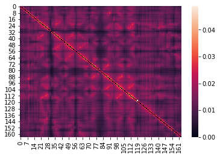
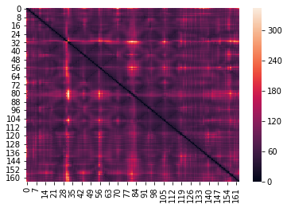
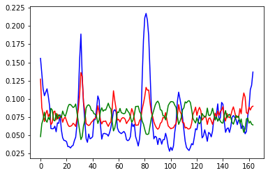

.. _tutorials_compliance:

Using the concept to Compliance to study Molecular Structures
=============================================================

This tutorial aims to get the user to familiarize with the concept of structural compliance. 

How to cite::

    Scaramozzino, D, Khade, PM, Jernigan, RL, Lacidogna, G, Carpinteri, A. Structural compliance: 
    A new metric for protein flexibility. Proteins. 2020; 1– 11. https://doi.org/10.1002/prot.25968

Step 1
------

1. Import the 'molecule' submodule from PACKMAN. (If PACKMAN is not installed, please follow the link: https://github.com/Pranavkhade/PACKMAN)

2. Download the structure from PDB and save it with the appropriate extension.

3. Load the structure using the submodule::

    #Step 1.1
    from packman import molecule

    #Step 1.2
    molecule.download_structure('1LF7')
    #OR (Default is CIF format; to change it to PDB)
    #molecule.download_structure('1LF7',ftype = 'pdb')

    #Step 1.3
    mol=molecule.load_structure('1LF7.cif')
    #OR
    #mol=molecule.load_structure('1LF7.pdb')

Step 2
------

1. Import 'anm' submodule from PACKMAN.

2. Load the C-Alpha atoms of the molecule from the first model. For further information about the atoms selection and 'molecule' object functions, please read the PACKMAN 'molecule' tutorials.

3. Build the ANM model of the selected atoms. With appropriate power (Please refer to the Publication)::

    #Step 2.1
    from packman import anm

    #Step 2.2
    c_alpha = mol[0].get_calpha()

    #Step 2.3
    ANM_MODEL = anm.ANM( c_alpha, pf=True, dr=float('Inf'), power=3 )

Step 3
------

Calculate the Hessian Matrix, Decompose it and Run the stiffness and compliance analysis.::

    #Step 3
    ANM_MODEL.calculate_hessian()
    ANM_MODEL.calculate_decomposition()
    ANM_MODEL.calculate_stiffness_compliance()

Step 4
------

Extract and store the maps and profiles for the visualization.::

    stiffness_map  = ANM_MODEL.get_stiffness_map()
    compliance_map = ANM_MODEL.get_compliance_map()

    b_factors          = [i.get_bfactor() for i in c_alpha]
    fluctuations       = ANM_MODEL.get_fluctuations()
    stiffness_profile  = ANM_MODEL.get_stiffness_profile()
    compliance_profile = ANM_MODEL.get_compliance_profile()

Step 5
------

Import any visualization package such as seaborn and visualize the stiffness profile.::

    import seaborn as sns
    sns.heatmap(stiffness_map)

Step 6
------

Similarly, for the compliance profile::

    sns.heatmap(compliance_map)

Step 7
------

Visualize the profiles and compare them with the experimental B-factors.::

    from matplotlib import pyplot as plt
    import numpy

    plt.plot(b_factors/numpy.linalg.norm(b_factors)                   ,color= 'blue')
    plt.plot(compliance_profile/numpy.linalg.norm(compliance_profile) ,color=  'red')
    plt.plot(stiffness_profile/numpy.linalg.norm(stiffness_profile)   ,color='green')
    plt.show()

Step 8
------
Calculate the Pearson Correlation Coefficient between any profile and the experimental B-factors.::

    from scipy.stats import pearsonr
    pearsonr(b_factors,compliance_profile)

(0.7879402882589035, 6.05510642055883e-36)