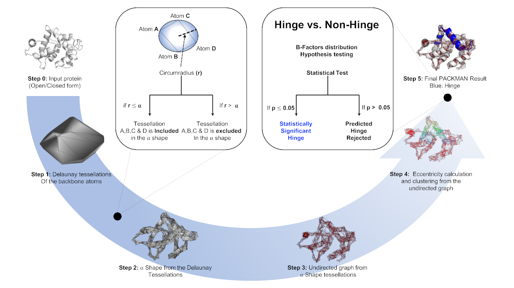

.. _tutorials_predict_hinge:

Hinge Prediction using Alpha Shape (API)
========================================

This tutorial familiarises users with the API of the Hinge Prediction algorithm using Alpha Shapes. The same functionality is also available in the PACKMAN commandline interface ( :ref:`tutorials_hinge_prediction` ).

How to cite::

    Pranav M. Khade, Ambuj Kumar, Robert L. Jernigan, Characterizing and Predicting Protein Hinges for 
    Mechanistic Insight, Journal of Molecular Biology, Volume 432, Issue 2, 2020, Pages 508-522,
    ISSN 0022-2836, https://doi.org/10.1016/j.jmb.2019.11.018.

Note: If PACKMAN is not installed, please follow the link: https://github.com/Pranavkhade/PACKMAN

QUICK ALGORITHM OVERVIEW
------------------------

Please visit the following for the 15 minute video about the algorithm: https://youtu.be/3ALOxMqR1EA

Step 1: Loading Structure
-------------------------

In this section, we load the file containing the molecular structure. To understand in dept about the :mod:`packman.molecule` object, pelase visit :ref:`tutorials_molecule`

Code Example::

    from packman import molecule

    #File loading 
    mol=molecule.load_structure('1exr.pdb')

    #If the backbone atoms of the ALL chains needs to be studied,
    #backbone=[]
    #for i in [i.get_id() for i in mol[0].get_chains()]:
    #        backbone.append( [k for j in mol[0][i].get_backbone() for k in j if k is not None] )
        
    
    #If the backbone atoms of the specific chain 'A' needs to be studied,
    backbone = [j for i in mol[0][chain].get_backbone() for j in i if j is not None]

Step 2: Hinge Prediction
------------------------
Call the :mod:`packman.apps.predict_hinge` with the backbone atoms selected in the Step 1 with specific alpha value and an output file::

    predict_hinge(backbone, Alpha=2.8, outputfile=open('output.txt', 'w'))

This process can be done for the multiple alpha values.::

    alpha_start, alpha_stop, step_size = 0 , 10 , 0.5
    for i in numpy.arange(alpha_start, alpha_stop, step_size):
            i = numpy.around(i, decimals=1)
            try:
                predict_hinge(atoms, Alpha=i, outputfile=open(str(i)+'.txt', 'w'))
            except:
                continue

The output will be saved in the .txt format with alpha value as a filename.

Step 3: Hinge Objects
---------------------

After running hinge prediction, along with the text output, :mod:`packman.molecule.annotations.Hinge` object is saved with all corresponding information.

The following code can access all such hinges for all alpha values explored::

    #If chain is known,
    mol[0]['A'].get_hinges()

    #If you are browsing atoms and not sure about the chain
    atoms[0].get_parent().get_parent().get_hinges()

