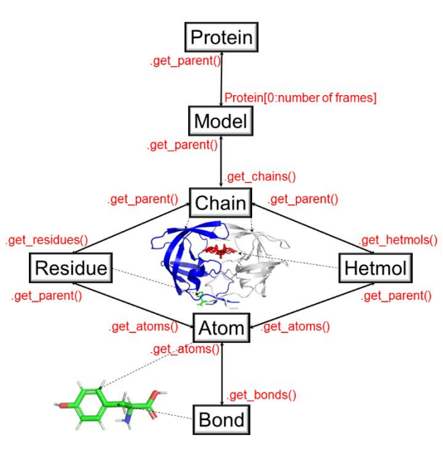

.. _tutorials_molecule:

Using 'Molecule' to load and manupulate molecular structures. (Basics)
======================================================================

This module is base for all the algorithms and programs written in the PACKMAN. This tutorial aims to give an idea about the information flow and hierarchy in the objects. Once the object's basic understanding is developed, all the objects' advanced special features can be explored on their object documentation page.

Citation:
    Pranav M Khade, Robert L Jernigan, PACKMAN-Molecule: Python Toolbox for Structural Bioinformatics,
    Bioinformatics Advances, 2022;, vbac007, https://doi.org/10.1093/bioadv/vbac007

Figure 1. The object hierarchy of the :mod:`packman.molecule` submodule. (Figure taken from the paper cited at the top)

Downloading & Loading
---------------------

Example to download a file from PDB::

    from packman import molecule
    molecule.download_structure('1prw')
    #OR (Default is CIF format; to change it to PDB)
    #molecule.download_structure('1prw',ftype = 'pdb')

Example to load a downloaded file into a 'Protein' object (Fig 1)::

    Protein = molecule.load_structure('1prw.cif')
    #OR
    #Protein = molecule.load_structure('1prw.pdb')

Get Methods
-----------

Protein structure stores all the information there is about the protein. To access that information, the user can access the get methods. As shown in figure 1, we can use 'get' methods to go from :mod:`packman.molecule.protein` object to :mod:`packman.molecule.atom` object.
It is important to know that this is not the only protocol to obtain information. (eg.. :mod:`packman.molecule.atom` can directly obtained from :mod:`packman.molecule.model` object by doing Model.get_atoms() )

Protein to Atom Example::

    #Selecting 1st frame (Multiple frames can exist if the structure is obtained from NMR 
    #or is a trajectory)
    First_Frame = Protein[0]

    #Get All the Chains from the first frame
    for i in First_Frame.get_chains():
        print(i)

    #Get specific chain from the first frame
    ChainA = First_Frame['A']

    #Get residues from the Chain A
    Residues = [i for i in ChainA.get_residues()]

    #Get Atoms of the first residue (0th Index)
    AtomsOfTheFirstResidues = Residues[0].get_atoms()

    #There are many more get functions such as getting C-Alpha atom of the residue 
    #(Check Object Documentation for more details)
    CAlphaAtomsOfTheFirstResidue = Residues[0].get_calpha()

Atom to Protein::

    #Each object is linked to it's parent object and can be obtained by using get_parent() 
    #method in the corrosponding objects
    CAlphaAtomsOfTheFirstResidue.get_parent()

    #Get all the way to Protein object
    CAlphaAtomsOfTheFirstResidue.get_parent().get_parent().get_parent().get_parent()

Atom Object
----------- 

The :mod:`packman.molecule.atom` object holds all the important information as it is the lowest in the object hierarchy. The information such as it's coordinates, B-factors, occupancy, etc. can be obtained using various get methods. Please check the :mod:`packman.molecule.atom` object documentation for more information.

Set Methods
-----------

Each object with a method for any property has a set method to manipulate that property. Please check the corresponding object documentation for more information.

Calculate Methods
-----------------

Calculate methods use the available information in the PDB do carry out calculations required to return the output. eg.. :func:`packman.molecule.atom.calculate_distance`

Bottomline
----------

There are many more features planned and already available that are not yet noted in this tutorial. This is just an essential guide to familiarize the user with the hierarchy of the module. Please feel free to message me if you have an idea to improve this module or to add new features. We are also welcoming new developers for the improvement of this module.
